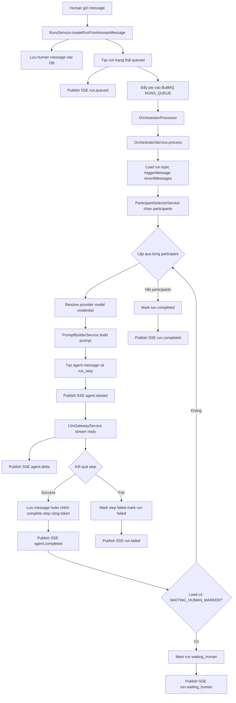
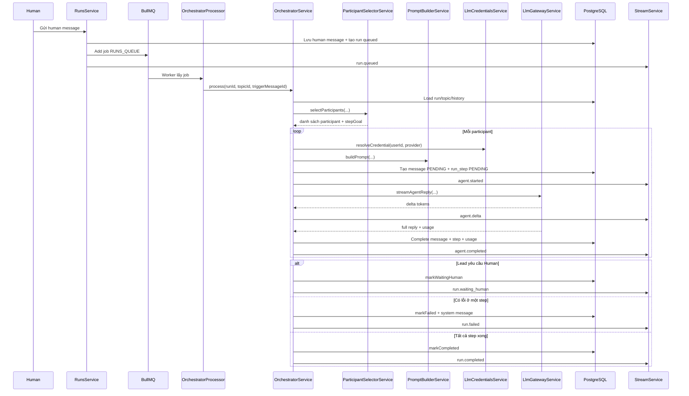

# Current Backend Runtime

File này mô tả ngắn gọn backend đang chạy thật trong repo hiện tại, tập trung vào `OrchestratorService`.

## 1. Sơ đồ tổng quan

## 2. Sequence diagram

## 3. Luồng tổng thể

1. Human gửi message vào topic.
2. `RunsService.createRunFromHumanMessage()` lưu human message, chặn trùng active run, tạo `run` ở trạng thái `queued`.
3. Job của run được đẩy vào BullMQ queue `RUNS_QUEUE`.
4. `OrchestratorProcessor` lấy job và gọi `OrchestratorService.process()`.
5. Orchestrator chọn agent tham gia lượt này, chạy từng step theo thứ tự, stream token qua SSE, lưu kết quả vào DB.
6. Run kết thúc theo một trong các trạng thái: `completed`, `waiting_human`, `failed`, hoặc `cancelled`.

## 4. Điểm vào quan trọng

- `backend/src/runs/runs.service.ts`
  Tạo human message, create run, enqueue job, publish `run.queued`.
- `backend/src/orchestrator/orchestrator.processor.ts`
  Worker BullMQ gọi `OrchestratorService`.
- `backend/src/orchestrator/orchestrator.service.ts`
  Runtime chính của một run.

## 5. Orchestrator chạy thế nào

### Bước 1. Chuẩn bị run

- Load `run`, bỏ qua nếu đã `cancelled` hoặc `completed`.
- Mark run thành `running`.
- Publish SSE `run.started`.
- Load `topic`, `triggerMessage`, `recentMessages`.

### Bước 2. Chọn participant

`ParticipantSelectorService` chọn một tập con agent cho lượt hiện tại:
- ưu tiên agent được `@mention`
- sau đó chọn theo heuristic role và keyword
- giới hạn số agent theo `ORCHESTRATOR_MAX_PARTICIPANTS`

Hiện tại đây là policy heuristic, không phải planner nhiều vòng phức tạp.

### Bước 3. Resolve route cho từng agent

Với mỗi participant:
- lấy agent config từ topic
- resolve `effectiveProvider = agent.provider ?? topic.sharedProvider`
- resolve `effectiveModel = agent.model ?? topic.sharedModel`
- lấy API key qua `LlmCredentialsService`

Nghĩa là backend hiện đã hỗ trợ route theo từng agent, không còn chỉ 1 model chung cho cả topic.

### Bước 4. Build prompt

`PromptBuilderService` ghép:
- title topic
- provider/model mặc định của topic
- provider/model hiệu lực của agent hiện tại
- latest human message
- recent history
- output của các step trước trong cùng run
- step goal do participant selector tạo ra

Lead được phép hỏi lại Human bằng marker `WAITING_HUMAN_MARKER`. Agent khác thì không.

### Bước 5. Tạo step + message

Trước khi gọi model, Orchestrator tạo trong DB:
- một agent message `PENDING`
- một `run_step` `PENDING`

Sau đó:
- message -> `STREAMING`
- step -> `RUNNING`
- publish SSE `agent.started`

### Bước 6. Gọi LLM và stream

`LlmGatewayService` gọi model thật:
- `openai` dùng `responses.create`
- `anthropic`, `openrouter`, `nvidia-compatible` dùng `chat.completions.create`

Mỗi delta token được publish qua SSE `agent.delta`.

### Bước 7. Kết thúc step

Nếu step thành công:
- lưu full content vào message
- detect mentions
- complete `run_step`
- cộng token usage vào run
- thêm output vào `previousStepOutputs`
- publish `agent.completed`

Nếu lead output có `WAITING_HUMAN_MARKER`:
- run -> `waiting_human`
- publish `run.waiting_human`
- dừng orchestration ngay

### Bước 8. Fail hoặc complete run

Nếu một step lỗi:
- message -> `FAILED`
- step -> `FAILED`
- run -> `FAILED`
- tạo thêm system message báo lỗi
- publish `run.failed`

Nếu toàn bộ step xong:
- run -> `COMPLETED`
- publish `run.completed`

## 6. Cách cancel run

- `RunsService.cancelRun()` mark run `cancelled`
- gọi `RunExecutionRegistryService.abort(runId)`
- `AbortController` đang giữ trong Orchestrator sẽ dừng request stream hiện tại
- publish `run.cancelled`

## 7. SSE event quan trọng

- `run.queued`
- `run.started`
- `agent.started`
- `agent.delta`
- `agent.completed`
- `run.waiting_human`
- `run.failed`
- `run.completed`
- `run.cancelled`

## 8. Điều cần nhớ

- Chỉ có `1 active run` cho mỗi topic.
- Run hiện chạy `tuần tự theo step`, chưa chạy song song nhiều agent trong cùng một run.
- Agent sau có thể đọc output của agent trước trong cùng run qua `previousStepOutputs`.
- Human luôn là người quyết định cuối cùng; lead chỉ tổng hợp hoặc hỏi lại Human khi cần.
